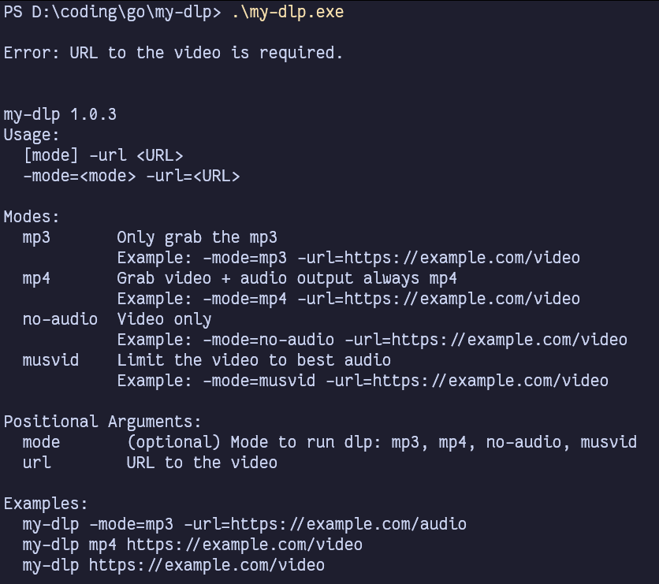

# custom-dlp

dont you just hate it when you want to download something then have to do the mental gymnastic of remembering `-f` followed by the plethera of options ? well not to worry just add more complexities with this project :D, by not using the config and doing things your self... you save 10 seconds of reading the docs and used 2 hour for learning a new language and another 1 hour to debug it :D... fun right ??? well anyway this is a simple wrapper for customized options shortcuts for yt-dlp, yes i know there is a way to do this with out using a whole nother language, but imma be honest i do be lazy and i hated that batch script didnt work and always hated how if you use ps script you have to do this allow unsigned script thinga ma bob... so no thank you and in desperation and pure exhaustion, desperation, and pure stupidity... i give you

## my-dlp


already hated the project ? GOOD... there is a reason why its called my-dlp not our-dlp... 

## build

now if you excused me i need to remind this dumbass called myself on how to compile this dumpsterfire... because believe me this dude can't even remember a password that was being reset 5 seconds ago, and now he want to build something ?? god forbid... well anyway to compile the project just do
```bash
go build -o my-dlp.exe ./my-dlp.go
```
yeah so that's that... see ya
